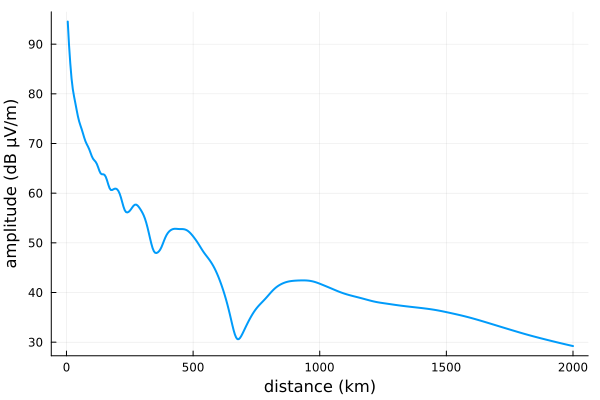

# LongwaveModePropagator.jl

[](https://fgasdia.github.io/LongwaveModePropagator.jl/stable)
[](https://fgasdia.github.io/LongwaveModePropagator.jl/dev)
[![Build status][gha-img]][gha-url]

**Model the propagation of VLF radio waves in the [Earth-ionosphere waveguide](https://en.wikipedia.org/wiki/Earth%E2%80%93ionosphere_waveguide).**

LongwaveModePropagator.jl is a mode theory propagation model written in the [Julia](https://julialang.org/) programming language.
The model is largely based on the work of K. G. Budden, who developed both a convenient means of calculating an effective reflection coefficient for the anisotropic ionosphere [(Budden, 1955)](#Budden1955a) and a general method for calculating the electric field produced by a source dipole in the Earth-ionosphere waveguide [(Budden, 1962)](#Budden1962).
It is similar to the Long Wavelength Propagation Capability [(Ferguson, 1998)](#Ferguson1998), but aims to be more robust and adaptable.

The package is most easily used when interfacing with it from Julia, but it can also run simple cases by reading in JSON files and writing the results back to JSON.
See the **Examples** section of [the docs](https://fgasdia.github.io/LongwaveModePropagator.jl/stable) for examples of building scenarios and running the model from within Julia and for generating compatible files from Matlab and Python.

## Installation instructions

1. [Download](https://julialang.org/downloads/) and install a recent version of Julia for your operating system.
2. From the Julia REPL, install LongwaveModePropagator.jl and its dependencies

```
    julia> ]
    (v1.5) pkg> add https://github.com/fgasdia/LongwaveModePropagator
    (v1.5) pkg> instantiate
```

If you'll be working primarily in Julia, of course you probably want to `cd` to your working directory, `] activate` a new environment there, and then `add` LongwaveModePropagator.

Julia has an excellent built-in package manager (accessed by typing `]` from the REPL) that also keeps track of the versions of all dependencies within an environment.
This means you can leave your code, come back to it two years later on a new computer, and as long as you have all the original files from your working directory (including the `Project.toml` and `Manifest.toml` files), you can `instantiate` the exact environment you were last working with.
To update the environment (while maintaining compatibility across all dependencies), simply
`] up`.

As with most Julia packages, LongwaveModePropagator.jl is released under the MIT license and all source code is [hosted on GitHub](https://github.com/fgasdia/LongwaveModeSolver).
Please open Issues or Pull requests if you find any problems, are interested in new features, or you would like to be a contributor.

## Running your first model

Here's a simple homogeneous ground/ionosphere scenario defined in Julia.
Note that throughout the code SI units (MKS) and radians are used.
The only notable exception in the current version of the package is the use of kilometers and inverse kilometers to define Wait and Spies h′ and β parameters for the electron density profile.

```julia
using LongwaveModePropagator
using LongwaveModePropagator: QE, ME

# "standard" vertical dipole transmitter at 24 kHz
tx = Transmitter(24e3)

# sample vertical electric field every 5 km out to 2000 km from tx
rx = GroundSampler(0:5e3:2000e3, Fields.Ez)

# vertical magnetic field
bfield = BField(50e-6, π/2, 0)

# daytime ionosphere
electrons = Species(QE, ME, z->waitprofile(z, 75, 0.35), electroncollisionfrequency)

# "typical" earth ground
ground = Ground(10, 1e-4)

waveguide = HomogeneousWaveguide(bfield, electrons, ground)

# return the complex electric field, amplitude, and phase
E, a, p = propagate(waveguide, tx, rx);
```

We can plot the results if we `] add Plots`:

```julia
using Plots

plot(rx.distance/1000, a, xlabel="distance (km)", ylabel="amplitude (dB)")
```



I encourage you to browse through the **Examples** section of the docs to see how to construct more complex examples.

## New to Julia?

Julia is a relatively new general programming language that particularly shines when it comes to technical computing.
It has similarities to Matlab and Python, but is high performance and attempts to solve the ["two language problem"](https://thebottomline.as.ucsb.edu/2018/10/julia-a-solution-to-the-two-language-programming-problem).
In part, it achieves its high performance by compiling functions to efficient native code via LLVM.
Julia is dynamically typed and uses multiple dispatch, so that the first time a given function is passed arguments of a certain type, the function is compiled for those types.
In practice, this means that the first time a function is called, it appears to take longer than it will on subsequent calls because at the first call the function was also compiled.

### Finding help

I highly recommend reading the [Julia Documentation](https://docs.julialang.org/en/v1/).
It is very thorough and combines significant text explanations with examples.

Besides the regular REPL prompt `julia>` and the package mode accessed with `]`, there is also a help mode accessible with `?`.
`?` works "automatically", even for user-defined functions with docstrings.
Most internal functions of LongwaveModePropagator.jl are documented, so e.g.
```julia
? LongwaveModePropagator.bookerquartic
```
prints some explanation of the `bookerquartic` function even though it's not exported from the package.


## References

<a name="Budden1955a"></a>K. G. Budden, “The numerical solution of differential equations governing reflexion of long radio waves from the ionosphere,” Proc. R. Soc. Lond. A, vol. 227, no. 1171, pp. 516–537, Feb. 1955, doi: [10.1098/rspa.1955.0027](https://doi.org/10.1098/rspa.1955.0027).

<a name="Budden1962"></a>K. G. Budden, “The influence of the earth’s magnetic field on radio propagation by wave-guide modes,” Proceedings of the Royal Society of London. Series A. Mathematical and Physical Sciences, vol. 265, no. 1323, pp. 538–553, Feb. 1962, doi: [10.1098/rspa.1962.0041](https://doi.org/10.1098/rspa.1962.0041).

<a name="Ferguson1998"></a>J. A. Ferguson, “Computer programs for assessment of long-wavelength radio communications, version 2.0: User’s guide and source files,” Space and Naval Warfare Systems Center, San Diego, CA, Technical Document 3030, May 1998. [Online]. Available: http://www.dtic.mil/docs/citations/ADA350375.

## Citing

We encourage you to cite this package if used in scientific work. See the Zenodo
badge above or refer to [CITATION.bib](CITATION.bib).


[gha-img]: https://github.com/fgasdia/LongwaveModePropagator.jl/workflows/CI/badge.svg
[gha-url]: https://github.com/fgasdia/LongwaveModePropagator.jl/actions?query=workflow
